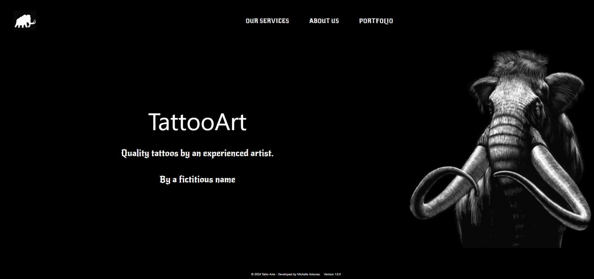

## TattooArt Plataform

### Online platform for professional tattoo artist.

<h1 align="center">
    
</h1>

### Video demonstration:

- https://www.loom.com/share/2ab785705af04941a444e812ef147f0f?sid=9530c059-14b8-4257-8a7e-daffc79b2cc4

### Table of Contents:

- <a href="#Objective"> Objective </a>
- <a href="#Technologies Used"> Technologies Used </a>
- <a href="# Next Steps"> Next Steps </a>
- <a href="#Authorship"> Authorship </a>
- <a href="#ProjectStatus"> Project Status </a>

## Objective

The main objective was to apply and improve my recently acquired knowledge of the PHP language.

All the images and information are fictitious and have no purpose in providing relevant information on the subject.

Layout taken partly from the Figma platform. 

## Technologies Used

### Front-End:

1. [PHP](https://www.php.net/)
2. [Tailwind CSS](https://tailwindcss.com/)
3. [AWESOME](https://fontawesome.com/)

### Authorship

Michelle Antunes, Abril/2024.
 

<kbd>[Linkedin](www.linkedin.com/in/michelle-antunes-868b24156)</kbd>
 
Email: miichelleantunes@outlook.com

### Project Status

Completed!
